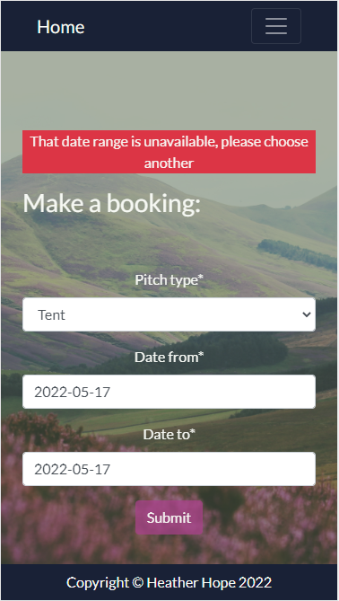
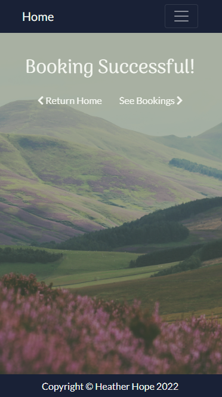
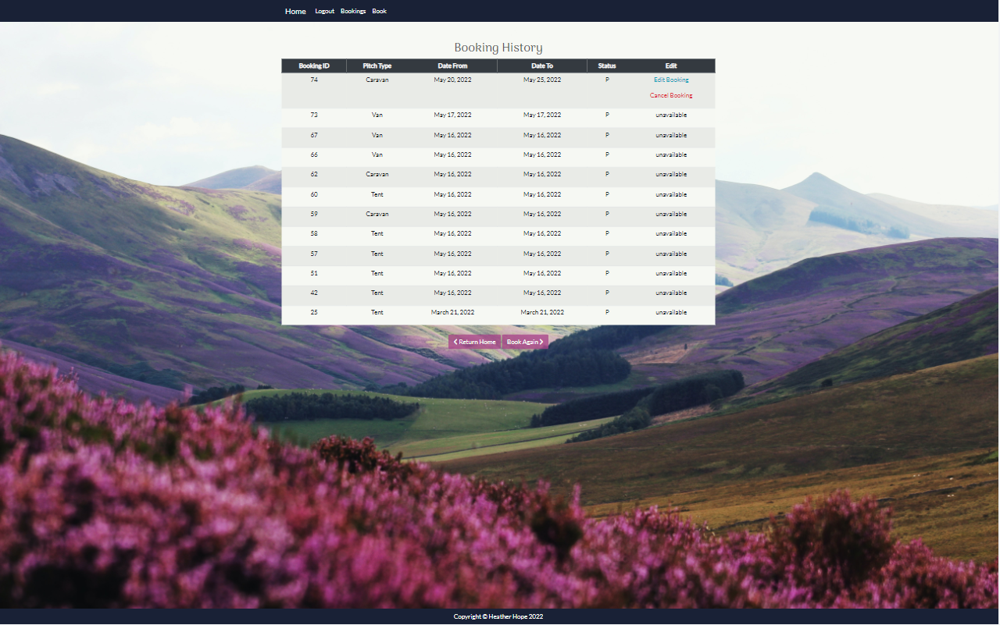
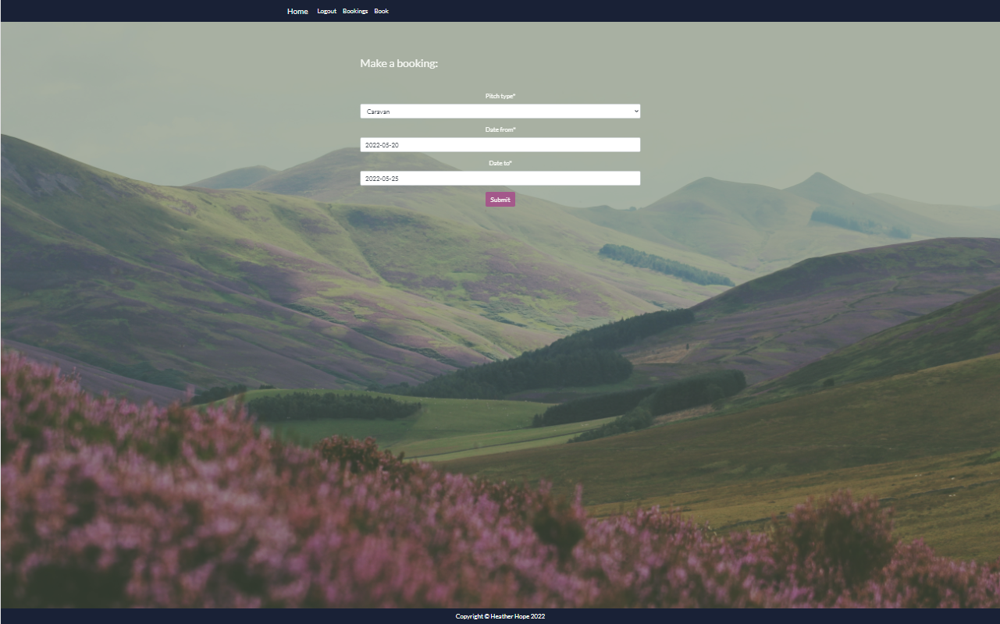
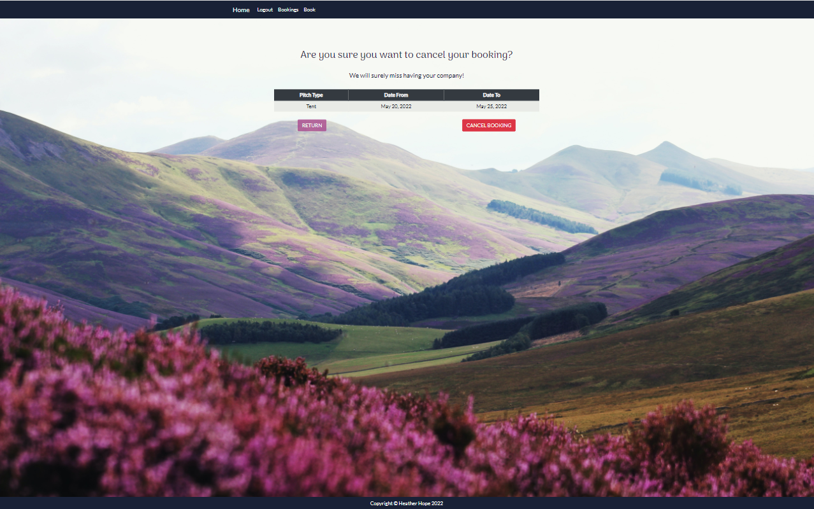
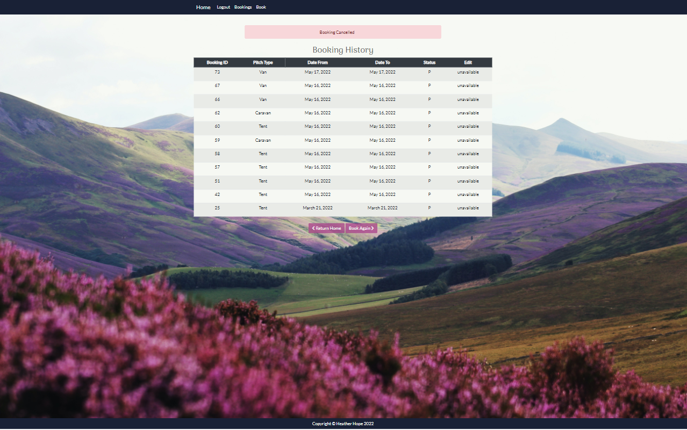
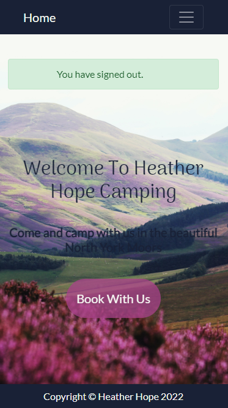

# Heather Hope Camping
Portfolio Project 4 Full Stack Toolkit - Code Institute

Find the app [here](https://heatherhope-camp.herokuapp.com/)

# About
The Heather Hope Campsite is a fictional campsite set in the vast expanse of the North York Moors, a place to go for respite from a busy life and adventure. Ever popular, the campsite requires an app with integrated booking service to manage bookings and avoid disappointment for customers. As the business is still expected to receive bookings traditionally via phone calls or "walk-ins" the booking service will still be manually administrated with regards to approvals for bookings.

Note all screen shots have been taken with the iPhone SE responsive sizer (from chrome) and 2560 x 1600 px as a standard 13" laptop screen.

# User Experience
The app will largely be managed by the campsite staff and thus has two main user perspectives: customers and the business.

## Business Goals
Heather Hope is a (fictional) campsite that can host a range of camping arrangements from tents to caravans, motorhomes or vans. The goal of building this booking service is to:
- provide potential customers with an indication of whether the site is available for the pitch type they require at the dates they desire
- keep track of their bookings
- begin building a consistent brand with themic styling

## User Goals
This site will be used by both business staff and customers thus must consider both perspectives.

From a business staff perspective, the site needs to:
- Allow staff to manually approve bookings and send an alert to the customer of the outcome
- Be able to edit the pitches available (both type and number)
- Be able to review bookings
- Be able to manually add bookings from walk-ins or mobile attempts

From a user perspective, the site needs to:
- Be easy to navigate
- Show availability of potential bookings
- Submit bookings for approval
- Review booking history
- Edit potential bookings
- Cancel potential bookings
- See contact information for the site
- See marketing material to help make the decision of whether they want to visit the site

A number of features are requried to carry out these needs and these will be discussed throughout this README.

## User Stories
This project has been tracked using [GitHub Projects](https://github.com/users/mmoore483/projects/2) which contains all the current user stories.

## Structure
Whilst the focus of this project is on the booking capability, the wireframes consider other elements of the user and business experience that may be implemented in the future.

<strong>Home Page - Wireframe</strong>

The home page will be responsive with the top menu dropping into a hamburger icon on smaller screen sizes as well as a sticky nav bar to ensure the user can always get to the booking page within a single click. This navbar will be consistent across the entire site for ease of navigation. The "Log in" option on the menu will also update to "Sign Out" once a user is logged in. To achieve the desired look, bootstrap styling will be used. Other themic features include a hero image with a call to action button encouraging potential customers to book. This image can be used in other places (e.g. social media) to allow for brand building. Below that, there will be calls to visit the other marketing-type pages on the site including a photo library of facilities and views. 

<strong>Home Page - Actual</strong>
The current home page uses a beautiful image of heather on moorland, consistent with the name and location of the campsite. This image is used across the site for consistent styling and colours for the theme were taken from this image. The navbar is sticky and also collapses down on smaller screen sizes. 

In the future, the circular links to other pages will be included as those pages are developed - enough space has been left on the laptop views to make this look more appealing.

 

<strong>Log In/Sign Up/Sign Out - Intention</strong>

The user requires capability to sign up/log in so that they can make an account and manage their own bookings. Using an email address rather than a username should make it easier for users to remember their details for a site account that is likely to be rarely used. Additionally, the business can keep customer details on file in case of emergencies or last minute cancellations. The majority of the sign up and log in functionality will be achieved using the Django admin site and account templates with the same styling as other pages.
Note: the wireframe has been removed from the readme as I didn't feel it was adding anything: it was essentially a simple form, the same as the standard allauth template.

<strong>Log In/Sign Up/Sign Out - Actual</strong>
As desired, a custom model was created so that only email was required to create an account and sign in - not a username. The styling is the same as that of the rest of the site however there is an overlay with one of the accent colours

<strong>Book - Wireframe</strong>

The booking page will be kept simple with the desire pitch type and dates (preferably with a date picker as this is a better visual for the user but can also restrict data entry). One the submission button has been pressed, the database will be queried and availability displayed back to the user.

<strong>Book - Actual</strong>

The booking page has been kept simple however does not contain a date selector as desired during planning - this can be implemented at a later date. The form is simple and is designed with a secondary accent colour overlay for consistent styling. Prior to access to the booking form, a user must be signed in to ensure that any booking forms submitted could be tied to a customer which the business could contact if required. 

<strong>Photos</strong>

The photo page is for the business to entice customers with beautiful images of the campsite. The page layout is simple three column on large screens and one column on small screens. This is a nice-to-have feature that won't be a priority.

<strong>Contact Us</strong>

The Contact Us Page is another form page that allows the user to make enquiries to the business easily. This is a simple form that will automate an email sent to the business and a copy of the email sent to the customer. 

### Database Planning

There needs to be a user table that will be used for account management and for the business to be able to contact customers. This table will contain all details about the customer from email, to name, to phone number etc. The only compulsory fields will be the auto-generated customer_id and the email address as this allows for a unique customer.

There needs to be an area to set business variables such as the different camping pitch types and the quantity of each. This is required to check there is availability. These will only be seen in the admin panel and can only be changed by "superusers" or administrators of the site. Therefore the table is not directly linked but will be queried to ensure that there is availability.

The final table is for the bookings themselves, this will tie in the customer_id where one customer can have multiple bookings however each booking can only have one customer. Therefore this is a one (customer_id) to many (Booking) relationship. The Booking table will also have a unique ID, this will also allow users to query the status of their booking in communication with the business. The booking also requires the pitch type and the dates at which the booking is expected to take place. The status will be pending if available, confirmed if accepted by the business administrators and cancelled if rejected or the user chooses to cancel their booking. Finally, the created_on field can be used to sort bookings so that the business administrators can accept bookings on a first-come-first-serve basis. 

### Comment on Logic

1) The customer will fill in the booking form and press submit
2) The app will read in submitted information and filter the booking table by dates and pitch type
3) Using the customer requested pitch type, the Business Variables table will be queried for the quantity of that pitch type available
4) The number of results from step 2 will be compared to step 3 and if less, then the form will be saved to the database and the status will be set to pending. A notification should be displayed to the user that their booking is pending business confirmation. If the value is higher, then the customer will be told that the dates requested are unavailable and give them the option to try again.
5) The business user can then change the status and this will send a notification the customer account of the outcome. 

## Surface

The BootStrap Theme [scrolling nav](https://startbootstrap.com/template/scrolling-nav) has been adapted for use in this project and modified with standard bootstrap classes as well as unique styling.

The background image used in the site (beautiful healther in moorland) was found on [unsplash](https://unsplash.com/photos/f44QzL2ynzo?utm_source=unsplash&utm_medium=referral&utm_content=creditShareLink) and the colour theme was selected from this image using the colour picker tool on Chrome. The site's colour palette is comprised of a dark blue/black colour and a white shade as these colours provide the best contrast and have been used for text throughout the site. The purple/pink and green colour are used as accents and generally have been made more transparent in order to not detract from the background image. 

With regards to fonts, the cursive font of Arima Madurai is used to give visual appeal in main headings. The open sans font of Lato is easy to read and used for the majority of the site for that reason.

## User Stories - Achieved So Far
The user stories names are from the project tracker found [here](https://github.com/users/mmoore483/projects/2).
User Story | Ways in which met |
---|---|
Account Creation| An account can be created easily from the "Register" button featured on every page via the navbar. It is also accessible from the log in page and the booking page (providing you aren't already logged in).|
Create a Booking| Once authenticated, it is possible to make a booking using the booking form. There is also feedback of direction to a booking successful page or a note that those dates are unavailabe and to try again. However, it does require a datepicker as manual entry of dates is difficult and not user-friendly.|
Booking History| Once logged in, this feature is available on the navbar or you can choose to go to it from the booking successful page. It contains a table of all bookings the currently logged in user has made including the booking id (useful for referencing the booking if in contact with the Heather Hope Administration team), the pitch type, the dates selected and then an option to edit or delete the booking if they are in the future.|
Easy Navigation| The navigation bar is sticky in instances where the page gets long. On small screens, the navbar becomes collapsible to allow better use of screen real estate with other features however the Home button is always available. On every page of the site, the most relevant next link is available via buttons e.g. the booking success page directs to booking history or to return home. |
Creating a Brand| Across the site, a consistent image and colour scheme has been used. The cursive font used for the headings and "Welcome to Heather Hope Camping" text could easily be used to create a text logo of "Heather Hope" to be used across other media. The moorland image could also be used on the banner of a facebook page.|
Approve/Reject Bookings| At present this feature is only possible using the standard django administration back end. However, in the future, this should be improved to be accessible through the site itself if the user is authenticated as an administrator with a custom page to achieve this.|
Pitch Variation| The option of business variables e.g. pitch types and the number of each has been integrated into the model and the logic so these are editable in the django administration back end. However, in the future, this should be improved to be accessible through the site itself if the user is authenticated as an administrator. 

 

## Main Features

Feature | Advantages |
---|---|
Navbar| The sticky navbar is available across all pages for familiarity and ease of the user. The navbar is also collapsible so on small screens the links to other pages don't take up too much space or become compressed and difficult for the user to press. The navbar is also responsive to signed in users vs. signed out users which is a useful indication for users of the site.|
Footer | The footer is the same across all pages too and in future, will be easy to update with contact details etc. as it is contained within a base template that all others inherit from.|
Background Image| The background image is consistent across all of the site with different coloured transparent overlays for contrast promotion where text or forms are required. This quickly allows the site to be recognisable across different platforms in the future providing the same image is used. The coloured overlays are accent colours picked from the image itself allowing for a consistent use of colour that is aesthetically pleasing to some.|
Call to action| The home page contains a call to action button that immediately takes the user to the main point of the site: a booking service.|
Username = Email| The user only needs to enter an email and password to register for the site which is useful as usernames are often forgotten if the site is used inconsistently and becomes a chore for the user to reset etc. As the business is essentially a holiday/vacationing service, it's unlikely to be used frequently enough for details such as a username to be remembered.|
Sign in before booking| Trying to access the booking page without signing in redirects the user to either log in or sign up. This ensures that contact details are available to the business should they need to contact the user after a booking.|
Booking Form| The booking form itself contains pitch type from a dropdown selection however requires manual entry of the dates. There is very limited validation and this requires improvement. There is some validation in terms of submission in that if there is not a pitch available at the dates, it will inform the user with a message in red and ask them to try again. However it is possible to enter dates that are in the past and use letters which will cause the site to fail. As the business case is that an administrator will approve or cancel bookings, these errors are currently expected to be manually spotted.|
Booking Successful| After a successful booking, the user is taken to a booking successful page that contains two links to either return home or to see the booking history.|
Booking History| The booking history page contains a list of all successful bookings in a simple table. The table is responsive to screen size and allows for horizontal scrolling on smaller sizes. The table also contains the option to edit or cancel bookings providing that they are in the future.|
Edit Booking| Providing the booking is in the future, users have the opportunity to edit a booking. Upon pressing edit, the user is directed to the booking form that is pre-filled with their current booking information. Once they have changed, their booking request is returned to the "pending" status and will require re-approval. The logic still checks the booking availability as per the normal booking form.|
Cancel Booking| The booking cancellation option takes the user to an interim page where they are asked to ensure they really want to cancel. This gives the customer a reminder of the booking they want to cancel and a second chance to keep their booking just in case it was accidentally pressed.|
Messages| Throughout the site, there are pop up messages that time out just as a visual feedback to user that their request has been accepted by the site. This includes signing in, signing out, making a booking etc.|

### More images of features 
Images displayed are contained within the READMEImages folder as well as other screenshots of the site. Below are a few demonstrating the features from the table above.

The following in screenshots showing the original booking history, editing the top result and then cancelling the booking altogether.

Here is an example of the messages around the site

 

## Future Features

- Notification of booking status changes via email
- Administration with regards to approving bookings etc. will be done through the main site with role dependent access rather than going to the django administration part of the app.
- A Photo Page
- Business details available in the footer as well as a separate page
- A Contact Form that automates sending an email to business
- A date picker for the booking dates selection in Booking page
- The above date picker would block out unavailable dates visually during the selection process

## Testing

### User Story Testing
Has been commented on above.

### Validator Testing
- HTML [W3C Validator](https://validator.w3.org/) No Errors on the Home, Log In, Register or Book pages.

- CSS [jigsaw validator](https://jigsaw.w3.org/css-validator/) No errors found.

- Python Pylint ha sbeen used throughout code creation and the main files have been run through the [PEP8 online validator](http://pep8online.com/) without error except line too long where it's 81 characters instead of 80 for example.

### Functional Testing (Manual)

Testing is undertaken on a desktop on Chrome using the iPhone SE filter and the 2560 x 1600 px screen size to check for responsiveness and legibility of text throughout the site.

Feature/Page| Test | Pass/Fail|
---|---|---|
Navbar| Click each link on the navbar to make sure it went to the correct location| Pass|
Navbar| Ensure navbar collapses down on smaller screens and links remain clickable| Pass|
Navbar| When logged out, check the navbar states "Home Register Login Book"| Pass|
Navbar| When logged in, check the navbar states "Home Logout Bookings Book"|Pass|
Sign Up| Check email validation works by entering an invalid email address| Pass|
Sign Up| Check password validation works by entering two different passwords| Pass|
Sign Up| Check password strength is validated by using the password "test"| Pass|
Sign Up| Check email cannot be used twice to sign up. Create an account once and then try to create another with the same email. |Pass|
Sign Up| Create a valid account. Check this logs you in and receive the successful sign in message in green| Pass|
Sign Up| Following the above test, check that the confirmation email is sent| Fail
Messages| Check messages timeout and close automatically after a small amount of time| Pass|
Messages| Check sign in message uses the user's name/email when popping up| Fail|
Messages| Sign in, sign out, booking update, booking cancelled all timeout after a short period of time and disappear from the screen automatically| Pass|
Book| Check the booking form is unavailable when no user is logged in| Pass|
Book| Check the book page redirect sign up button works| Pass|
Book| Check the book page redirect login button works| Pass|
Book| Check the booking form pitch type is a drop down list that allows different selections to be made| Pass|
Book| Check the date from form field only accepts numbers by attempting to enter "cat" itno the date field and submitting the form| Fail - this caused a server 500 error|
Book| Check the date from form field only accepts future dates by entering 2021-01-01 in the date from field| Fail - this caused a booking successful response|
Book| Check the form only accepts "available" spots by setting the Business Variable Motorhome pitch quantity to zero and then attempt to make a motorhome booking on the book page. This should return the form again with a message in red that the date was unavailable and to try again| Pass|
Book| Fill the form in with the pitch type tent, the default dates (these should read the current date of testing) and press submit. This should take you to a booking_successful template page| Pass|
Booking Successful| Check the booking successful return home button returns the user to the home page| Pass|
Booking Successful| Check the booking successful return see bookings button takes the user to the Booking History Page| Pass|
Booking History Page| Check the tent and default dates (these should read the current date of testing) entry appears in the booking history table| Pass|
Booking History Page| Check the entry mentioned above has "unavailable" in the Edit column with the status "P"| Pass|
Booking History Page| Make a new booking on the booking form using tomorrow's dates and the tent pitch type. Check the Booking History table contains this new entry and has the options to Edit Booking and Cancel Booking| Pass|
Booking History Page| Go to the site's admin page and approve the booking created. Return to the booking history page and see if the status for that booking entry has been updated to say "A"| Pass|
Booking History Page| Press the edit booking button from the entry created above and check it takes you to a pre-filled booking form page with the entry's booking details| Pass|
Edit Booking| Following the above test, make a change in pitch type but keep the dates the same and resubmit the form. Check this action returns you to the Booking History page and brings up the message "Booking Updated."|Pass|
Edit Booking| Following the above test, check the table has been updated with the new pitch type under the same booking ID with the status updated to "P"|Pass|
Cancel Booking| Following the above test, press cancel booking on the table and check it takes you to a booking_delete page. (note the booking ID will also be in the url).|Pass|
Cancel Booking| Following the above test, press the return button and ensure it takes you back to the booking history table|Pass|
Cancel Booking| Following the above test, press the cancel button again and this time, press cancel booking on the booking delete page. Ensure this returns you to the Booking History page with the message "Booking Cancelled" and that the entry has been removed from the booking history table.|Pass|
Booking History| Ensure the two links below the table, "return home" and "book again" take you to the correct locations (e.g. the home page and the booking form respectively)| Pass|
Sign out| Following the previous testing where logging in was required, press Logout on the navbar and check it takes you to a sign out page asking whether you are sure you want to sign out| Pass|
Sign out| Following the previous test, press the sign out button as confirmation. This should return you to the home page with a message saying "You have signed out."| Pass|
Log In| Following the sign out testing, go to the navbar and press log in and ensure the account created previously allows access to the site| Pass|
404 error| Go to the end of the url and add the word "cat", check this returns the user to a 404 page within the site| Fail|

 

### Bugs
- The log in messages requires a username which isn't available due to the email nature of log in. This causes the message to look weird and grammatically incorrect.
- The date selection in booking form requires validation
- No confirmation email is sent from the site (need to include email details for django)
- Need to create a custom 404 page that would help the user stay on the website and direct them to where they need to go. 

# Deployment

### Create Application and Postgres DB on Heroku
- Log in to Heroku at https://heroku.com - create an account if needed.
- From the Heroku dashboard, click the Create new app button.  For a new account an icon will be visible on screen to allow you to Create an app, otherwise a link to this function is located under the New dropdown menu at the top right of the screen.
- On the Create New App page, enter a unique name for the application and select region.  Then click Create app.
- On the Application Configuration page for the new app, click on the Resources tab.
- In the Add-ons search bar enter "Postgres" and select "Heroku Postgres" from the list - click the "Submit Order Form" button on the pop-up dialog.
- Next, click on Settings on the Application Configuration page and click on the "Reveal Config Vars" button - check the DATABASE_URL has been automatically set up. 
- Add a new Config Var called DISABLE_COLLECTSTATIC and assign it a value of 1.
- Add a new Config Var called SECRET_KEY and assign it a value - any random string of letters, digits and symbols.
- The settings.py file should be updated to use the DATABASE_URL and SECRET_KEY environment variable values as follows :

  - DATABASES = {'default': dj_database_url.parse(os.environ.get('DATABASE_URL'))}

  - SECRET_KEY = os.environ.get('SECRET_KEY')

- In Gitpod, in the project terminal window, to initialize the data model in the postgres database, run the command python3 manage.py migrate 
- Make sure the project requirements.txt file is up to date with all necessary supporting files by entering the command pip3 freeze --local > requirements.txt
- Commit and push any local changes to GitHub.
- In order to be able to run the application on localhost, add SECRET_KEY and DATABASE_URL and their values to env.py

### Connect the Heroku app to the GitHub repository
- Go to the Application Configuration page for the application on Heroku and click on the Deploy tab.
- Select GitHub as the Deployment Method and if prompted, confirm that you want to connect to GitHub. Enter the name of the github repository (the one used for this project is (https://github.com/mmoore483/camping) and click on Connect to link up the Heroku app to the GitHub repository code.
- Scroll down the page and choose to either Automatically Deploy each time changes are pushed to GitHub, or Manually deploy - for this project Manual Deploy was selected.
- The application can be run from the Application Configuration page by clicking on the Open App button.
- The live link for this project is (https://heatherhope-camp.herokuapp.com/)

### Final Deployment steps
Once code changes have been completed and tested on localhost, the application can be prepared for Heroku deployment as follows:
- Set DEBUG flag to False in settings.py
- Ensure requirements.txt is up to date using the command pip3 freeze --local > requirements.txt
- Push files to GitHub
- In the Heroku Config Vars for the application delete this environment variable DISABLE_COLLECTSTATIC
- On the Heroku dashboard go to the Deploy tab for the application and click on deploy branch

## Forking

To trial changes to the site without affecting the original, the GitHub Repository can be forked.

- Log into GitHub and locate the desired repository
- In the top right, click the Fork button.

## Cloning

[Cloning](https://docs.github.com/en/github/creating-cloning-and-archiving-repositories/cloning-a-repository-from-github/cloning-a-repository) is useful for a multitude of reasons: to contribute to a project, to trial changes, to fix merge conflicts, add or remove files, and push larger commits.

- Log into your GitHub then find the gitpod repository
- Click the Code button
- If cloning with HTTPS, click the clipboard icon to copy the link
- Open Gitbash
- Change the current working directory to the location where you want the cloned directory to be.
- Type git clone, and then paste the URL you copied earlier.
- Press enter to create your local clone

# Credits

- Code Institute for the template and course content
- [BootStrap Theme](https://startbootstrap.com/template/scrolling-nav)
- The Very Academy YouTube for [videos](https://www.youtube.com/watch?v=Ae7nc1EGv-A&ab_channel=VeryAcademy) on creating administration panels
- [Background image](https://unsplash.com/photos/f44QzL2ynzo?utm_source=unsplash&utm_medium=referral&utm_content=creditShareLink)
- Coolors co for creation of the colour palette image
- LucidCharts for diagramming including the above database diagram
- Mentor: Brian Machari
- Tutor Support: James 
- Student Support: Kieron
